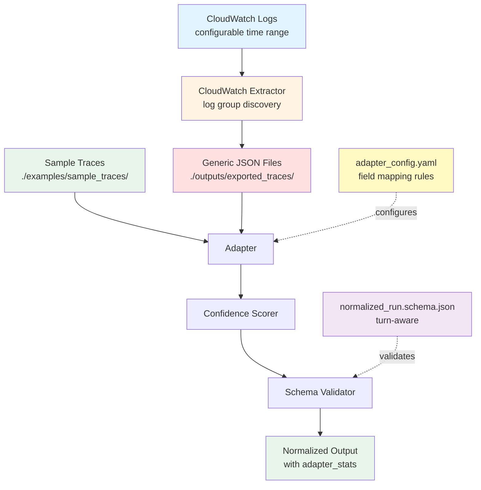

# Design Document: Generic JSON Adapter and Normalized Schema

## Overview

This design specifies the implementation of a Generic JSON adapter and normalized schema for the agent-eval module. The system transforms arbitrary agent execution traces into a standardized format, enabling consistent offline analysis across different trace sources. The design emphasizes graceful degradation with confidence scoring, config-driven field mapping, multi-turn conversation support, and strict module isolation.

The implementation consists of four main components:
1. A JSON Schema defining the normalized trace format with turn-aware structure
2. A Python adapter that transforms Generic JSON traces into the normalized format using config-driven mapping
3. A YAML configuration file defining field mapping rules and step classification
4. A CloudWatch log extraction utility with configurable time ranges and log group discovery

## Architecture

### Component Diagram



### Data Flow

1. **Configuration Loading**: Load adapter_config.yaml with field mapping and classification rules
2. **Test Data Generation**: 
   - Manual: Create sample traces in `examples/sample_traces/`
   - Automated: Run CloudWatch extractor with configurable time range (default 90 days) and log group discovery
3. **Normalization**: Process Generic JSON files through adapter with config-driven mapping
4. **Confidence Scoring**: Calculate confidence scores based on data quality and missing fields
5. **Validation**: Schema validator ensures output compliance with turn-aware structure
6. **Testing**: Validate against diverse sample traces including multi-turn conversations and messy real traces

### Module Isolation

All components reside under `agent-eval/agent_eval/`:
- `schemas/normalized_run.schema.json` - Turn-aware schema definition
- `adapters/base.py` - Base adapter interface/protocol for consistency across adapters
- `adapters/generic_json/adapter.py` - Adapter implementation with confidence scoring
- `adapters/generic_json/adapter_config.yaml` - Config-driven field mapping rules
- `tools/cloudwatch_extractor.py` - Log extraction utility with time range configuration
- `utils/validation.py` - Shared validation utilities

**Future Modular Structure** (optional, post-Phase 1):
- `adapters/generic_json/canonicalize.py` - Field canonicalization logic
- `adapters/generic_json/classify.py` - Step classification logic
- `adapters/generic_json/segment.py` - Turn segmentation logic
- `adapters/generic_json/derive.py` - Derived field calculation
- `adapters/generic_json/emit.py` - Output emission logic

Dependencies are declared only in `agent-eval/pyproject.toml`.

## Components and Interfaces

### 1. Normalized Schema (`schemas/normalized_run.schema.json`)

**Purpose**: Define the canonical structure for agent execution traces with turn-aware multi-turn conversation support.

**Schema Structure**:

```json
{
  "$schema": "http://json-schema.org/draft-07/schema#",
  "title": "Normalized Agent Run",
  "type": "object",
  "required": ["run_id", "metadata", "adapter_stats", "turns"],
  "properties": {
    "run_id": {
      "type": "string",
      "description": "Unique identifier for this agent execution"
    },
    "metadata": {
      "type": "object",
      "description": "Run-level metadata",
      "properties": {
        "source": {"type": "string"},
        "adapter_version": {"type": "string"},
        "processed_at": {"type": "string", "format": "date-time"}
      }
    },
    "adapter_stats": {
      "type": "object",
      "description": "Adapter processing statistics and confidence metrics",
      "properties": {
        "total_events_processed": {"type": "integer"},
        "events_with_valid_timestamps": {"type": "integer"},
        "events_with_missing_data": {"type": "integer"},
        "confidence_penalties": {
          "type": "array",
          "items": {
            "type": "object",
            "properties": {
              "reason": {"type": "string"},
              "penalty": {"type": "number"},
              "location": {"type": "string"}
            }
          }
        }
      }
    },
    "turns": {
      "type": "array",
      "description": "Array of conversation turns",
      "items": {
        "type": "object",
        "required": ["turn_id", "user_query", "final_answer", "steps", "confidence"],
        "properties": {
          "turn_id": {
            "type": "string",
            "description": "Unique identifier for this turn"
          },
          "request_id": {
            "type": ["string", "null"],
            "description": "Optional request identifier from source system"
          },
          "timestamp": {
            "type": ["string", "null"],
            "format": "date-time",
            "description": "ISO 8601 timestamp of turn start"
          },
          "user_query": {
            "type": "string",
            "description": "The user query for this turn"
          },
          "final_answer": {
            "type": "string",
            "description": "The final response for this turn"
          },
          "steps": {
            "type": "array",
            "description": "Ordered list of execution steps",
            "items": {
              "type": "object",
              "required": ["name", "status"],
              "properties": {
                "type": {
                  "type": ["string", "null"],
                  "description": "Step type (e.g., 'tool_call', 'sub_agent_call', 'message')"
                },
                "kind": {
                  "type": ["string", "null"],
                  "description": "Step kind for finer classification"
                },
                "name": {
                  "type": "string",
                  "description": "Human-readable step name"
                },
                "status": {
                  "type": "string",
                  "enum": ["success", "error"],
                  "description": "Step execution outcome"
                },
                "start_ts": {
                  "type": ["string", "null"],
                  "format": "date-time",
                  "description": "Step start timestamp"
                },
                "end_ts": {
                  "type": ["string", "null"],
                  "format": "date-time",
                  "description": "Step end timestamp"
                },
                "latency_ms": {
                  "type": ["number", "null"],
                  "description": "Step execution time in milliseconds"
                },
                "span_id": {
                  "type": ["string", "null"],
                  "description": "Tracing span identifier"
                },
                "parent_span_id": {
                  "type": ["string", "null"],
                  "description": "Parent span identifier for nested operations"
                },
                "tool_run_id": {
                  "type": ["string", "null"],
                  "description": "Tool execution identifier"
                },
                "attributes": {
                  "type": ["object", "null"],
                  "description": "Additional structured attributes"
                },
                "raw": {
                  "type": ["object", "null"],
                  "description": "Raw source data for debugging"
                }
              }
            }
          },
          "normalized_latency_ms": {
            "type": ["number", "null"],
            "description": "Latency calculated from trusted timestamps"
          },
          "runtime_reported_latency_ms": {
            "type": ["number", "null"],
            "description": "Latency reported by source system"
          },
          "total_latency_ms": {
            "type": ["number", "null"],
            "description": "Total execution time (prefers normalized_latency_ms)"
          },
          "confidence": {
            "type": "number",
            "minimum": 0,
            "maximum": 1,
            "description": "Confidence score for this turn's data quality"
          }
        }
      }
    }
  },
  "additionalProperties": false
}
```

**Design Decisions**:
- Use JSON Schema Draft 7 for broad compatibility
- Turn-aware structure with `turns[]` array for multi-turn conversations
- Run-level fields: run_id, metadata, adapter_stats
- Turn-level fields: turn_id, user_query, final_answer, steps, confidence scores
- Dual latency tracking: normalized_latency_ms (from timestamps) and runtime_reported_latency_ms (from source)
- Enhanced step fields: type, kind, span_id, parent_span_id, tool_run_id, attributes, raw
- Confidence scoring system with adapter_stats tracking penalties
- Graceful degradation: most fields nullable with confidence penalties instead of hard failures
- additionalProperties: false ensures strict normalized output

### 2. Base Adapter Interface (`adapters/base.py`)

**Purpose**: Define a consistent interface/protocol for all adapters to ensure uniformity across different trace format adapters.

**Interface Definition**:

```python
from typing import Protocol, Dict, Any
from pathlib import Path


class Adapter(Protocol):
    """
    Protocol defining the interface for trace adapters.
    
    All adapters should implement this interface to ensure consistency
    across different trace format adapters (Generic JSON, CloudWatch, etc.).
    """
    
    def load_and_normalize_trace(self, path: str, config_path: str = None) -> Dict[str, Any]:
        """
        Load a trace file and normalize it to the standard schema.
        
        Args:
            path: Path to the trace file
            config_path: Optional path to adapter configuration
            
        Returns:
            Dictionary conforming to normalized schema with:
            - run_id, metadata, adapter_stats, turns[]
            - Each turn has confidence score (0-1)
            
        Raises:
            FileNotFoundError: If the trace file doesn't exist
            JSONDecodeError: If the file contains invalid JSON
            ValidationError: Only if no events exist or input is completely unreadable
        """
        ...
```

**Design Decisions**:
- Use Python Protocol (PEP 544) for structural subtyping
- Minimal interface: single public method for normalization
- Consistent signature across all adapters
- Future adapters (CloudWatch native, OpenTelemetry, etc.) will implement this interface
- Enables adapter registry and dynamic adapter selection

### 3. Generic JSON Adapter (`adapters/generic_json/adapter.py`)

**Purpose**: Transform Generic JSON trace files into normalized format using config-driven field mapping with confidence scoring and graceful degradation.

**Module Constants**:

```python
from pathlib import Path

# Default configuration path (works regardless of CWD)
DEFAULT_CONFIG_PATH = Path(__file__).with_name("adapter_config.yaml")
```

**Public API**:

```python
def load_and_normalize_trace(path: str, config_path: str = None) -> dict:
    """
    Load a Generic JSON trace file and normalize it to the standard schema.
    
    This is the single public entry point for trace normalization.
    
    Args:
        path: Path to the Generic JSON trace file
        config_path: Optional path to adapter_config.yaml (defaults to DEFAULT_CONFIG_PATH)
        
    Returns:
        Dictionary conforming to normalized schema with:
        - run_id, metadata, adapter_stats, turns[]
        - Each turn has confidence score (0-1)
        - adapter_stats contains confidence_penalties
        
    Raises:
        FileNotFoundError: If the trace file doesn't exist
        JSONDecodeError: If the file contains invalid JSON
        ValidationError: Only if no events exist or input is completely unreadable
        
    Behavior:
        - Graceful degradation: missing fields → null with confidence penalty
        - Config-driven field mapping from adapter_config.yaml
        - Dual latency tracking (normalized_latency_ms and runtime_reported_latency_ms)
        - Multi-turn conversation support with turn stitching
        - Orphan tool results handled with confidence penalties
        - Tool-looking text without markers not misclassified
    """
    if config_path is None:
        config_path = DEFAULT_CONFIG_PATH
    # Implementation...
    pass
```

**Internal Implementation Structure**:

```python
class _AdapterConfig:
    """Configuration loader for adapter_config.yaml."""
    
    def __init__(self, config_path: str):
        """Load configuration from YAML file."""
        self.field_mappings: dict = {}
        self.step_classification_rules: list = []
        self.confidence_penalty_weights: dict = {}
        self.load_config(config_path)
    
    def load_config(self, path: str) -> None:
        """Parse YAML configuration."""
        pass
    
    def get_field_mapping(self, target_field: str) -> list[str]:
        """Get source field paths for a target normalized field."""
        pass
    
    def classify_step(self, raw_step: dict) -> tuple[str, str]:
        """Classify step into type and kind based on rules."""
        pass


class _ConfidenceScorer:
    """Calculate confidence scores based on data quality with scope-aware penalty deduplication."""
    
    def __init__(self, config: _AdapterConfig):
        self.config = config
        self.penalties: list[dict] = []
        # Scope-aware penalty deduplication: track (scope, reason) tuples
        self._applied_penalties_per_run: set[tuple[str, str]] = set()
        self._applied_penalties_per_turn: dict[str, set[tuple[str, str]]] = {}
        # Track trusted timestamps for debugging
        self.trusted_timestamps: int = 0
        self.valid_timestamps: int = 0
    
    def add_penalty(self, reason: str, penalty: float, location: str, scope: str = "turn", turn_id: str = None) -> None:
        """
        Record a confidence penalty with scope-aware deduplication.
        
        Args:
            reason: Description of the issue (e.g., "missing_timestamp")
            penalty: Confidence reduction (0.0 to 1.0)
            location: Where the issue occurred (e.g., "turn_1.step_3")
            scope: Either "run" (applies to entire run) or "turn" (applies to specific turn)
            turn_id: Required when scope="turn", identifies which turn
            
        Behavior:
            - Deduplicates penalties by (scope, reason) to prevent double-counting
            - Run-level penalties: applied once per run regardless of how many turns trigger them
            - Turn-level penalties: applied once per turn, can repeat across different turns
            - Example: missing_timestamp at run-level (all turns) vs turn-level (specific turns)
        """
        if scope == "run":
            key = (scope, reason)
            if key in self._applied_penalties_per_run:
                return  # Already applied this run-level penalty
            self._applied_penalties_per_run.add(key)
        elif scope == "turn":
            if turn_id is None:
                raise ValueError("turn_id required when scope='turn'")
            if turn_id not in self._applied_penalties_per_turn:
                self._applied_penalties_per_turn[turn_id] = set()
            key = (scope, reason)
            if key in self._applied_penalties_per_turn[turn_id]:
                return  # Already applied this penalty for this turn
            self._applied_penalties_per_turn[turn_id].add(key)
        
        self.penalties.append({
            "reason": reason,
            "penalty": penalty,
            "location": location,
            "scope": scope
        })
    
    def calculate_turn_confidence(self, turn_id: str = None) -> float:
        """
        Calculate final confidence score (0-1) for a turn.
        
        Args:
            turn_id: Optional turn identifier for turn-specific penalty filtering
            
        Returns:
            Confidence score clamped to [0, 1]
        """
        # Sum penalties for this turn (both run-level and turn-level)
        total_penalty = sum(
            p['penalty'] for p in self.penalties
            if p.get('scope') == 'run' or (turn_id and p.get('location', '').startswith(turn_id))
        )
        return max(0.0, min(1.0, 1.0 - total_penalty))
    
    def get_adapter_stats(self, total_events: int, valid_ts: int, missing_data: int) -> dict:
        """
        Generate adapter_stats object with timestamp debugging information.
        
        Args:
            total_events: Total events processed
            valid_ts: Events with parsed timestamps (any format)
            missing_data: Events with missing fields
            
        Returns:
            Dictionary with processing statistics including trusted timestamp count
        """
        return {
            "total_events_processed": total_events,
            "events_with_valid_timestamps": valid_ts,
            "events_with_trusted_timestamps": self.trusted_timestamps,  # Surface for debugging
            "events_with_missing_data": missing_data,
            "confidence_penalties": self.penalties
        }


class _TraceNormalizer:
    """Internal class for trace normalization logic."""
    
    def __init__(self, config: _AdapterConfig, schema_path: str = None):
        """Load configuration and schema for validation."""
        self.config = config
        self.scorer = _ConfidenceScorer(config)
        pass
    
    def normalize(self, raw_data: dict) -> dict:
        """
        Transform raw Generic JSON into normalized format.
        
        Returns normalized dict with run_id, metadata, adapter_stats, turns[].
        """
        pass
    
    def _extract_run_id(self, data: dict) -> str:
        """Extract run_id using config-driven field mapping."""
        pass
    
    def _extract_metadata(self, data: dict) -> dict:
        """Extract run-level metadata."""
        pass
    
    def _extract_turns(self, data: dict) -> list[dict]:
        """Extract and normalize turns array, handling multi-turn stitching."""
        pass
    
    def _normalize_turn(self, turn_data: dict) -> dict:
        """Normalize a single turn with confidence scoring."""
        pass
    
    def _extract_steps(self, turn_data: dict) -> list[dict]:
        """Extract and normalize steps array."""
        pass
    
    def _normalize_step(self, step: dict) -> dict:
        """
        Normalize a single step with enhanced fields.
        
        Handles: type, kind, span_id, parent_span_id, tool_run_id, attributes, raw.
        """
        pass
    
    def _calculate_normalized_latency(self, steps: list[dict], turn_data: dict, turn_id: str) -> float | None:
        """
        Calculate latency from trusted timestamps with consistency checks.
        
        Args:
            steps: List of normalized steps
            turn_data: Raw turn data
            turn_id: Turn identifier for penalty tracking
            
        Returns:
            Latency in milliseconds or None if cannot be calculated
            
        Behavior:
            - Only uses timestamps marked as trusted (ts_trusted=True)
            - Requires at least 2 trusted timestamps to calculate latency
            - If trusted_ts_count >= 2 but latency is None, logs warning and applies penalty
            - Applies missing_latency penalty only when timestamps exist but latency cannot be computed
        """
        # Count events with trusted timestamps
        trusted_ts_count = sum(1 for step in steps if step.get('ts_trusted', False))
        
        if trusted_ts_count < 2:
            return None  # Not enough trusted timestamps
        
        # Calculate latency from trusted timestamps
        trusted_steps = [s for s in steps if s.get('ts_trusted', False)]
        start_ts = min(s['start_ts'] for s in trusted_steps if s.get('start_ts'))
        end_ts = max(s['end_ts'] for s in trusted_steps if s.get('end_ts'))
        
        if start_ts and end_ts:
            latency_ms = (parse_timestamp(end_ts) - parse_timestamp(start_ts)).total_seconds() * 1000
            return latency_ms
        
        # Invariant violation: trusted timestamps present but latency could not be computed
        self.warnings.append(f"{turn_id}: trusted timestamps present but latency could not be computed")
        self.scorer.add_penalty(
            "missing_latency",
            self.config.confidence_penalty_weights.get("missing_latency", 0.2),
            turn_id,
            scope="turn",
            turn_id=turn_id
        )
        return None
    
    def _extract_runtime_latency(self, turn_data: dict) -> float | None:
        """Extract runtime-reported latency if available."""
        pass
    
    def _handle_orphan_tool_results(self, steps: list[dict]) -> list[dict]:
        """Handle tool results without corresponding tool calls."""
        pass
    
    def _detect_tool_looking_text(self, step: dict) -> bool:
        """Detect text that looks like tools but isn't marked as TOOL_CALL."""
        pass
    
    def _validate_output(self, normalized_data: dict) -> None:
        """Validate output against normalized schema."""
        pass
```

**Transformation Logic**:

1. **Load Configuration**: Parse adapter_config.yaml for field mappings and rules
2. **Load JSON**: Read and parse the input file
3. **Extract Run-Level Fields**: Extract run_id, metadata using config mappings
4. **Extract Turns**: Parse turns array, handle multi-turn stitching
5. **For Each Turn**:
   - Extract turn_id, request_id, timestamp, user_query, final_answer
   - Extract and normalize steps with enhanced fields
   - Calculate normalized_latency_ms from timestamps
   - Extract runtime_reported_latency_ms if available
   - Handle orphan tool results and tool-looking text
   - Calculate confidence score based on data quality
6. **Generate adapter_stats**: Compile processing statistics and confidence penalties
7. **Validate**: Ensure output conforms to schema
8. **Return**: Return normalized dict

**Error Handling Strategy**:
- Missing required run-level fields → ValidationError only if no events exist
- Missing turn-level fields → null with confidence penalty
- Invalid timestamps → null, warning, confidence penalty
- Missing step fields → null with confidence penalty
- Orphan tool results → handled gracefully with confidence penalty
- Tool-looking text without markers → not misclassified
- Invalid JSON → JSONDecodeError with file path
- Completely unreadable input → ValidationError

### 4. Adapter Configuration (`adapters/generic_json/adapter_config.yaml`)

**Purpose**: Define config-driven field mapping rules, step classification logic, turn segmentation strategies, and confidence scoring in a production-ready, multi-stage pipeline configuration.

**Configuration Structure** (v6 - production-ready):

The configuration is organized into distinct processing stages that mirror the adapter's internal pipeline:

#### Stage A: Normalize (Field Mapping + Parsing)

```yaml
normalize:
  # Event discovery paths - where to find events in source JSON
  event_paths:
    - "events"
    - "trace.events"
    - "data.events"
    - "spans"
    - "resourceSpans.*.scopeSpans.*.spans"  # OpenTelemetry format
    - "logEvents"
    - "records"
    - "items"

  # Field aliases - map various source field names to normalized fields
  field_aliases:
    timestamp:
      - "timestamp"
      - "ts"
      - "time"
      - "start_time"
      - "startTime"
      - "observedTimestamp"
      - "startTimeUnixNano"  # OTEL epoch nanoseconds
    
    session_id:
      - "session_id"
      - "sessionId"
      - "conversation_id"
      - "attributes.session_id"
    
    trace_id:
      - "trace_id"
      - "traceId"
      - "traceIdHex"
      - "context.trace_id"
    
    span_id:
      - "span_id"
      - "spanId"
      - "id"
    
    tool_name:
      - "tool_name"
      - "toolName"
      - "function.name"
      - "attributes.tool_name"
    
    tool_run_id:
      - "tool_run_id"
      - "toolUseId"
      - "tool_use_id"
      - "toolCallId"
    
    # ... (50+ field aliases for comprehensive source format support)

  # Timestamp parsing configuration
  timestamp_parse:
    epoch_units: ["ms", "s", "ns"]
    infer_epoch_unit_by_magnitude: true
    min_reasonable_year: 2000
    max_reasonable_year: 2100
    unix_nano_fields: ["startTimeUnixNano", "endTimeUnixNano"]
    formats:
      - "%Y-%m-%d %H:%M:%S.%f"
      - "%Y-%m-%dT%H:%M:%S.%fZ"
      - "%Y-%m-%dT%H:%M:%SZ"
  
  # Raw data preservation
  carry_fields:
    attributes_paths:
      - "attributes"
      - "span.attributes"
      - "resource.attributes"
    keep_raw_event: true
    raw_event_max_bytes: 50000
```

#### Stage A: Classify (Event Meaning)

```yaml
classify:
  rule_order_policy: first_match_wins
  
  rules:
    - id: user_input_by_type_or_role
      kind: USER_INPUT
      any:
        - field: event_type
          regex: "(?i)user(_message|input)|human|input"
        - field: role
          regex: "(?i)^user$"
    
    - id: model_invoke_by_type_or_span_kind_or_model
      kind: MODEL_INVOKE
      any:
        - field: event_type
          regex: "(?i)model(_invoke|request)|llm(_invoke|request)"
        - field: span_kind
          regex: "(?i)client"
        - field: model_id
          exists: true
    
    - id: tool_call_strict
      kind: TOOL_CALL
      all:
        - field: tool_name
          exists: true
      any:
        - field: tool_run_id
          exists: true
        - field: event_type
          regex: "(?i)invocation|tool(_call|_invoke)"
    
    - id: tool_result_by_type_or_payload
      kind: TOOL_RESULT
      any:
        - field: tool_result
          exists: true
        - field: event_type
          regex: "(?i)tool(_result|_response)"
    
    # ... (additional classification rules)
  
  default_kind: EVENT
```

#### Stage B: Segment (Turn Segmentation)

```yaml
segment:
  # Strategy preference order (first successful strategy wins)
  strategy_preference:
    - TURN_ID                                    # Explicit turn_id fields
    - SESSION_PLUS_REQUEST                       # session_id + request_id
    - SESSION_PLUS_TRACE_THEN_ANCHOR_SPLIT       # Trace-based with anchor splitting
    - SINGLE_TURN                                # Fallback: treat all as one turn
  
  turn_id_fields: ["turn_id", "request_id"]
  
  # Request ID diagnosis for stitched traces
  request_id_diagnosis:
    distinct_user_prompts_per_request_id_max: 1
    request_ids_per_user_prompt_max: 3
    sample_window_events: 5000
  
  # Anchor events for turn boundaries
  anchor_events_in_order:
    - USER_INPUT
    - MODEL_INVOKE
  
  # Tie-breaker for event ordering within turns
  tie_breaker_order:
    - USER_INPUT
    - MODEL_INVOKE
    - TOOL_CALL
    - TOOL_RESULT
    - LLM_OUTPUT_CHUNK
    - EVENT
  
  emit_strategy_reason: true
  min_events_per_turn: 1
```

#### Stage C: Derive (Derived Fields)

```yaml
derive:
  # Phase classification for tool usage
  phases:
    pre_tool: PRE_TOOL_GENERATION
    tool_call: TOOL_CALL
    post_tool: FINAL_GENERATION
  
  # Prompt context stripping
  prompt_context_strip:
    strip_kinds: ["PROMPT_CONTEXT"]
    strip_text_regex:
      - "(?is)<guidelines>.*?</guidelines>"
      - "(?i)these are user preferences:"
  
  # Top-level output extraction
  output_extraction:
    top_level_path_syntax: "dot"
    top_level_dotpath_required: true
    top_level_fields:
      final_answer:
        - "final_answer"
        - "trace.final_answer"
        - "response.final_answer"
      user_query:
        - "user_query"
        - "query"
        - "prompt"
    
    # Assistant output streaming
    assistant_output_stream:
      include_kinds: ["LLM_OUTPUT_CHUNK"]
      exclude_if_text_matches_regex:
        - "(?is)<guidelines>.*?</guidelines>"
    join_with: ""
    max_chars: 200000
  
  # Tool linking (match tool calls with results)
  tool_linking:
    tool_run_exists_only_if:
      kind_in: ["TOOL_CALL"]
      tool_name_required: true
    tool_run_id_fields: ["tool_run_id"]
    link_results_by:
      - TOOL_RUN_ID
      - SPAN_PARENT_CHILD
    dedupe:
      enabled: true
      window_seconds: 2
      key_fields: ["tool_run_id", "tool_name"]
  
  # Latency calculation
  latency:
    normalized_latency_ms:
      start_from_first_kind_in: ["USER_INPUT", "MODEL_INVOKE"]
      end_at_last_kind_in: ["LLM_OUTPUT_CHUNK", "TOOL_RESULT"]
    keep_runtime_reported_latency_ms_fields:
      - "total_latency_ms"
      - "attributes.latency_ms"
    on_missing_timestamps: "null_and_penalize"
  
  # Attribution (tool usage detection)
  attribution:
    verdicts:
      tool_used_if_has_kind: "TOOL_CALL"
      tool_output_only_if_text_matches_regex:
        - "(?is)\\bRetrieved\\s+\\d+\\s+results\\b"
    stitch_suspect:
      enabled: true
      question_line_regex: "(?m)^.{3,300}\\?$"
      distinct_question_count_suspect_at: 2
```

#### Confidence Scoring

```yaml
confidence:
  scoring:
    base: 1.0
    penalties:
      missing_timestamp: 0.4
      missing_timestamp_low_coverage: 0.3  # Only when valid_timestamps > 0 but coverage < 20%
      missing_grouping_ids: 0.3
      missing_grouping_ids_low_coverage: 0.2  # Only when some IDs exist but coverage < threshold
      no_anchor_found: 0.3
      no_llm_output: 0.2
      missing_latency: 0.2  # Only when trusted timestamps exist but latency cannot be computed
  
  # Low-coverage penalty conditions (non-surprising, evidence-based)
  low_coverage_thresholds:
    timestamp_coverage_min: 0.2  # 20% minimum trusted timestamp coverage
    grouping_id_coverage_min: 0.3  # 30% minimum grouping ID coverage
    apply_only_if_evidence_exists: true  # Only penalize low coverage if some valid data exists
  
  emit_fields:
    - "run_confidence"
    - "turn_confidence"
    - "segmentation_strategy_used"
    - "mapping_coverage"

stats:
  emit_adapter_stats: true
  max_error_examples: 20
```

**Design Decisions**:
- **Multi-stage pipeline**: Normalize → Classify → Segment → Derive mirrors adapter implementation
- **Comprehensive field aliases**: 50+ field mappings support diverse source formats (OTEL, CloudWatch, custom)
- **Flexible segmentation**: 4 strategies with automatic fallback for stitched/multi-turn traces
- **Rule-based classification**: Regex-based event kind detection with first-match-wins policy
- **Tool linking**: Automatic matching of tool calls with results via tool_run_id or span hierarchy
- **Confidence scoring**: Explicit penalty weights for data quality issues
- **Production-ready**: Handles real-world edge cases (orphan results, stitched traces, missing timestamps)
- **Explicit contracts**: Documents required adapter implementation behaviors (e.g., dotted-path lookups)

**Key Features**:
1. **Event discovery**: Multiple paths for finding events in nested JSON structures
2. **Timestamp flexibility**: Supports ISO 8601, epoch (ms/s/ns), with magnitude-based inference
3. **Turn segmentation**: Intelligent multi-turn detection with anchor-based splitting
4. **Tool deduplication**: Prevents duplicate tool calls within time windows
5. **Output streaming**: Joins LLM output chunks while filtering prompt scaffolding
6. **Stitched trace detection**: Identifies and handles improperly stitched multi-turn traces

### 5. CloudWatch Export Utility (`tools/cloudwatch_extractor.py`)

**Purpose**: Extract CloudWatch logs with configurable time ranges and log group discovery, converting them to Generic JSON trace files.

**Script Structure**:

```python
#!/usr/bin/env python3
"""
CloudWatch log extraction utility with configurable time range and log group discovery.

This script pulls logs from CloudWatch and writes Generic JSON trace files.
It is NOT imported by the core adapter - it's a standalone fixture generator.

Usage:
    # With known log group
    python cloudwatch_extractor.py \
        --log-group /aws/lambda/my-agent \
        --days 90 \
        --output-dir ./outputs/exported_traces/
    
    # With log group discovery
    python cloudwatch_extractor.py \
        --log-group-prefix /aws/lambda/agent \
        --days 30 \
        --output-dir ./outputs/exported_traces/
"""

import argparse
import boto3
from datetime import datetime, timedelta
from pathlib import Path
import json
import re
from typing import Optional


def discover_log_groups(
    prefix: str = None,
    pattern: str = None
) -> list[str]:
    """
    Discover CloudWatch log groups by prefix or regex pattern.
    
    Args:
        prefix: Log group name prefix (e.g., '/aws/lambda/agent')
        pattern: Regex pattern to match log group names
        
    Returns:
        List of matching log group names
        
    Raises:
        NoCredentialsError: If AWS credentials not configured
        ClientError: If CloudWatch API call fails
    """
    pass


def export_cloudwatch_logs(
    log_group_name: str = None,
    log_group_prefix: str = None,
    log_group_pattern: str = None,
    days: int = 90,
    output_dir: str = "./outputs/exported_traces/",
    filter_pattern: str = None
) -> list[str]:
    """
    Export CloudWatch logs as Generic JSON trace files.
    
    Args:
        log_group_name: Specific CloudWatch log group name
        log_group_prefix: Log group prefix for discovery
        log_group_pattern: Regex pattern for log group discovery
        days: Number of days to look back (default 90)
        output_dir: Directory to save trace files
        filter_pattern: Optional CloudWatch Logs Insights filter
        
    Returns:
        List of created file paths
        
    Raises:
        NoCredentialsError: If AWS credentials not configured
        ClientError: If CloudWatch API call fails
        ValueError: If no log groups found and none specified
    """
    pass


def _query_cloudwatch(
    client,
    log_group_name: str,
    start_time: datetime,
    end_time: datetime,
    filter_pattern: str
) -> list[dict]:
    """
    Execute CloudWatch Logs Insights query with pagination.
    
    Handles:
    - Pagination for large result sets
    - Retry with exponential backoff
    - Empty result handling
    """
    pass


def _parse_log_to_generic_json(log_entry: dict) -> dict:
    """
    Parse a CloudWatch log entry into Generic JSON structure.
    
    Extracts fields based on expected log format and creates
    the Generic JSON structure that the adapter expects.
    
    Handles:
    - Multi-turn conversation stitching
    - Timestamp extraction and validation
    - Step classification markers
    """
    pass


def _save_trace_file(trace_data: dict, output_dir: str) -> str:
    """Save trace as JSON file with run_id-based filename."""
    pass


def main():
    """CLI entry point."""
    parser = argparse.ArgumentParser(
        description="Export CloudWatch logs to Generic JSON traces"
    )
    
    # Log group specification (mutually exclusive)
    group = parser.add_mutually_exclusive_group(required=True)
    group.add_argument(
        "--log-group",
        help="Specific CloudWatch log group name"
    )
    group.add_argument(
        "--log-group-prefix",
        help="Log group prefix for discovery (e.g., '/aws/lambda/agent')"
    )
    group.add_argument(
        "--log-group-pattern",
        help="Regex pattern for log group discovery"
    )
    
    parser.add_argument(
        "--days",
        type=int,
        default=90,
        help="Number of days to look back (default: 90)"
    )
    parser.add_argument(
        "--output-dir",
        default="./outputs/exported_traces/",
        help="Output directory for trace files"
    )
    parser.add_argument(
        "--filter",
        help="CloudWatch Logs Insights filter pattern"
    )
    
    args = parser.parse_args()
    
    try:
        files = export_cloudwatch_logs(
            log_group_name=args.log_group,
            log_group_prefix=args.log_group_prefix,
            log_group_pattern=args.log_group_pattern,
            days=args.days,
            output_dir=args.output_dir,
            filter_pattern=args.filter
        )
        
        print(f"✓ Exported {len(files)} trace files to {args.output_dir}")
        
    except ValueError as e:
        print(f"✗ Error: {e}")
        print("  No log groups found. Check your prefix/pattern or specify --log-group directly.")
        exit(1)
    except Exception as e:
        print(f"✗ Unexpected error: {e}")
        exit(1)


if __name__ == "__main__":
    main()
```

**Key Design Points**:
- **Standalone script**: Not imported by core adapter code
- **Fixture generator**: Creates test data for validation
- **CLI interface**: Easy to run manually or in scripts
- **Configurable time range**: Default 90 days, user-configurable
- **Log group discovery**: Support prefix and regex pattern matching
- **Explicit failure**: Clear error message if no log groups found
- **AWS-specific**: Only component that knows about CloudWatch
- **Generic JSON output**: Produces files that adapter can consume

**CloudWatch Integration**:
- Use `boto3.client('logs')` for API calls
- Query using CloudWatch Logs Insights or FilterLogEvents
- Configurable time range (default: 90 days)
- Log group discovery via describe_log_groups with prefix/pattern
- Handle pagination for large result sets
- Retry with exponential backoff for transient errors
- Empty result handling without error

**Output Format**:

Creates files like `./outputs/exported_traces/{run_id}.json`:

```json
{
  "run_id": "extracted-or-generated-uuid",
  "metadata": {
    "source": "cloudwatch",
    "log_group": "/aws/lambda/my-agent"
  },
  "turns": [
    {
      "turn_id": "turn-1",
      "request_id": "req-abc-123",
      "timestamp": "2024-01-15T10:30:00Z",
      "user_query": "What is the weather?",
      "final_answer": "The weather is sunny.",
      "steps": [
        {
          "type": "tool_call",
          "name": "weather_api",
          "status": "success",
          "start_ts": "2024-01-15T10:30:00.100Z",
          "end_ts": "2024-01-15T10:30:00.250Z",
          "latency_ms": 150.5,
          "span_id": "span-xyz",
          "tool_run_id": "tool-run-456"
        }
      ],
      "runtime_reported_latency_ms": 200.0
    }
  ]
}
```

### 6. Validation Utility (`utils/validation.py`)

**Purpose**: Shared validation logic for schema compliance checking and confidence scoring.

**Functions**:

```python
def load_schema(schema_path: str) -> dict:
    """Load and parse JSON Schema file."""
    pass

def validate_against_schema(data: dict, schema: dict) -> tuple[bool, list[str]]:
    """
    Validate data against JSON Schema.
    
    Returns:
        Tuple of (is_valid, error_messages)
    """
    pass

def validate_iso8601_timestamp(timestamp: str, formats: list[str] = None) -> tuple[bool, bool]:
    """
    Validate ISO 8601 timestamp format with trust semantics.
    
    Args:
        timestamp: Timestamp string to validate
        formats: Optional list of expected formats
        
    Returns:
        Tuple of (is_valid, is_trusted)
        - is_valid: timestamp can be parsed
        - is_trusted: timestamp format is reliable for latency calculation
        
    Trust Semantics:
        - Explicit known formats (ISO 8601, configured formats) → trusted
        - Explicit configured epoch units (when field is known) → trusted
        - Inferred by magnitude (guessing ms vs s vs ns) → untrusted
        - Untrusted timestamps can be used for display but not for latency calculation
        
    Examples:
        - "2024-01-15T10:30:00.123Z" → (True, True) - explicit ISO format
        - 1705318200000 with known field "startTimeUnixNano" → (True, True) - explicit unit
        - 1705318200 with magnitude inference → (True, False) - inferred unit
    """
    pass

def sanitize_latency(latency: any) -> float | None:
    """
    Convert latency to float, handling negative values and None.
    
    Negative values are converted to zero with warning.
    """
    pass

def calculate_confidence_score(penalties: list[dict], base_score: float = 1.0) -> float:
    """
    Calculate confidence score from penalty list.
    
    Args:
        penalties: List of penalty dicts with 'penalty' field
        base_score: Starting confidence (default 1.0)
        
    Returns:
        Final confidence score clamped to [0, 1]
    """
    pass
```

**Validation Library**: Use `jsonschema` library for schema validation.

## Data Models

### Input: Generic JSON Format

The adapter expects input files with this structure:

```python
{
    "run_id": str,              # Required
    "metadata": dict,           # Optional
    "turns": [                  # Required (can be empty array)
        {
            "turn_id": str,         # Required
            "request_id": str,      # Optional
            "timestamp": str,       # Optional (ISO 8601)
            "user_query": str,      # Required
            "final_answer": str,    # Required
            "steps": [              # Required (can be empty)
                {
                    "type": str,            # Optional
                    "kind": str,            # Optional
                    "name": str,            # Required
                    "status": str,          # Required (success or error)
                    "start_ts": str,        # Optional (ISO 8601)
                    "end_ts": str,          # Optional (ISO 8601)
                    "latency_ms": float,    # Optional
                    "span_id": str,         # Optional
                    "parent_span_id": str,  # Optional
                    "tool_run_id": str,     # Optional
                    "attributes": dict,     # Optional
                    "raw": dict            # Optional
                }
            ],
            "runtime_reported_latency_ms": float  # Optional
        }
    ]
}
```

**Note**: Config-driven field mapping allows flexible source field names. Unknown fields in input are preserved in step.raw for debugging.

### Output: Normalized Schema Format

The adapter produces output with this structure:

```python
{
    "run_id": str,                      # Always present
    "metadata": {                       # Always present
        "source": str,
        "adapter_version": str,
        "processed_at": str             # ISO 8601
    },
    "adapter_stats": {                  # Always present
        "total_events_processed": int,
        "events_with_valid_timestamps": int,
        "events_with_missing_data": int,
        "confidence_penalties": [
            {
                "reason": str,
                "penalty": float,
                "location": str
            }
        ]
    },
    "turns": [                          # Always present (can be empty)
        {
            "turn_id": str,                         # Always present
            "request_id": str | None,               # Nullable
            "timestamp": str | None,                # Nullable (ISO 8601)
            "user_query": str,                      # Always present
            "final_answer": str,                    # Always present
            "steps": [                              # Always present (can be empty)
                {
                    "type": str | None,             # Nullable
                    "kind": str | None,             # Nullable
                    "name": str,                    # Always present
                    "status": str,                  # Always "success" or "error"
                    "start_ts": str | None,         # Nullable (ISO 8601)
                    "end_ts": str | None,           # Nullable (ISO 8601)
                    "latency_ms": float | None,     # Nullable
                    "span_id": str | None,          # Nullable
                    "parent_span_id": str | None,   # Nullable
                    "tool_run_id": str | None,      # Nullable
                    "attributes": dict | None,      # Nullable
                    "raw": dict | None              # Nullable
                }
            ],
            "normalized_latency_ms": float | None,      # From timestamps
            "runtime_reported_latency_ms": float | None, # From source
            "total_latency_ms": float | None,           # Prefers normalized
            "confidence": float                         # 0.0 to 1.0
        }
    ]
}
```

### Internal: Confidence Penalty Record

For tracking data quality issues:

```python
{
    "reason": str,          # Description of the issue
    "penalty": float,       # Confidence reduction (0.0 to 1.0)
    "location": str         # Where the issue occurred (e.g., "turn_1.step_3")
}
```

### Internal: Adapter Statistics

For batch processing and quality reporting:

```python
{
    "total_events_processed": int,          # Total events seen
    "events_with_valid_timestamps": int,    # Events with trusted timestamps
    "events_with_missing_data": int,        # Events with null fields
    "confidence_penalties": list[dict]      # All penalties recorded
}
```

## Correctness Properties

*A property is a characteristic or behavior that should hold true across all valid executions of a system—essentially, a formal statement about what the system should do. Properties serve as the bridge between human-readable specifications and machine-verifiable correctness guarantees.*

### Property 1: Schema Compliance for Valid Inputs

*For any* Generic JSON trace that contains valid structure (readable JSON with at least one event), transforming it through the adapter should produce output that validates successfully against the normalized schema.

**Validates: Requirements 2.4, 2.7, 6.1**

### Property 2: Graceful Degradation with Confidence Penalties

*For any* trace with missing optional fields, the adapter should complete transformation successfully, emit null values for missing fields, and include corresponding confidence penalties in adapter_stats.

**Validates: Requirements 2.5, 2.6**

### Property 3: Dual Latency Tracking

*For any* trace with valid timestamps in steps, the adapter should calculate normalized_latency_ms from those timestamps. If the source provides runtime_reported_latency_ms, both values should be preserved in the output.

**Validates: Requirements 2.9, 2.10**

### Property 4: Invalid Timestamp Handling

*For any* trace with missing or invalid timestamps, the adapter should set latency_ms to null, apply a confidence penalty, and continue processing without failure.

**Validates: Requirements 2.11, 8.6**

### Property 5: Multi-Turn Conversation Support

*For any* trace containing multiple turns, the adapter should process all turns and produce a turns array where each turn has its own user_query, final_answer, steps, and confidence score.

**Validates: Requirements 2.12**

### Property 6: JSON Parsing Error Handling

*For any* file containing invalid JSON syntax, the adapter should raise a JSONDecodeError with a descriptive message including the file path.

**Validates: Requirements 3.1**

### Property 7: Type Validation

*For any* trace with fields of incorrect types (e.g., number instead of string), the adapter should raise a TypeError identifying the field and expected type.

**Validates: Requirements 3.3**

### Property 8: Adapter Independence from AWS

*For any* execution of the Generic JSON Adapter, it should complete successfully without importing boto3, AWS SDK modules, or requiring AWS credentials or network access.

**Validates: Requirements 5.1, 5.2, 5.3, 5.5**

### Property 9: Output Schema Validation

*For any* output produced by the adapter, it should validate successfully against the normalized schema using a JSON Schema validator.

**Validates: Requirements 6.1, 2.7**

### Property 10: Validation Error Details

*For any* trace that fails schema validation, the adapter should raise an error with specific details about which fields failed validation and why.

**Validates: Requirements 6.2**

### Property 11: Batch Processing Validation Reporting

*For any* batch of multiple trace files processed, the adapter should report validation status for each file individually and provide a summary with total processed, successful, and failed counts.

**Validates: Requirements 6.4, 6.5**

### Property 12: Unicode Preservation

*For any* trace containing Unicode characters in string fields, the adapter should preserve them correctly in the normalized output without corruption or encoding errors.

**Validates: Requirements 8.4**

### Property 13: Null Value Handling

*For any* trace containing explicit null values for optional fields, the adapter should handle them gracefully without errors.

**Validates: Requirements 8.5**

### Property 14: Messy Trace Handling

*For any* real-world messy trace with missing data, invalid timestamps, or other quality issues, the adapter should produce valid output with adapter_stats populated and non-zero confidence penalties rather than failing.

**Validates: Requirements 9.3**

### Property 15: Duplicate Run ID Independence

*For any* set of traces with duplicate run_id values, the adapter should process each trace independently without conflicts or data corruption.

**Validates: Requirements 8.2**

## Error Handling

### Error Categories

1. **File Errors**
   - `FileNotFoundError`: Input file doesn't exist
   - `PermissionError`: Cannot read input or write output
   - `JSONDecodeError`: Invalid JSON syntax

2. **Validation Errors** (Graceful Degradation)
   - Most missing fields → null with confidence penalty (no exception)
   - Only raise `ValidationError` if: no events exist OR input completely unreadable
   - `TypeError`: Field type doesn't match expected type (critical errors only)
   - `ValueError`: Invalid field value that cannot be recovered

3. **AWS Errors** (CloudWatch Extractor only)
   - `AuthenticationError`: Invalid or missing AWS credentials
   - `ClientError`: CloudWatch API call failure
   - `NoCredentialsError`: AWS credentials not configured
   - `ValueError`: No log groups found when discovery fails

### Graceful Degradation Strategy

The adapter prioritizes graceful degradation over hard failures:

- **Missing optional fields** → null + confidence penalty
- **Missing required fields** → null + confidence penalty (except no events at all)
- **Invalid timestamps** → null + confidence penalty + warning
- **Orphan tool results** → handled + confidence penalty
- **Tool-looking text without markers** → not misclassified
- **Negative latencies** → converted to zero + warning

Only fail hard when:
- JSON is completely unparseable
- No events exist in the trace
- Critical type mismatches that prevent processing

### Error Messages

All errors should include:
- Clear description of what went wrong
- Context (file path, field name, location)
- Guidance on how to fix the issue (when applicable)

**Example Error Messages**:

```python
# Invalid JSON
"JSONDecodeError: Failed to parse JSON from file 'trace_123.json'. "
"Syntax error at line 45: unexpected token '}'. "
"Please ensure the file contains valid JSON."

# No events found
"ValidationError: No events found in trace file 'trace_456.json'. "
"The trace must contain at least one event to process."

# Type mismatch (critical)
"TypeError: Field 'steps' has type 'str' but expected 'array'. "
"Value: 'invalid'. Location: turn_1"

# AWS authentication (CloudWatch extractor)
"AuthenticationError: AWS credentials not found or invalid. "
"Please configure credentials using 'aws configure' or environment variables."

# Log group discovery failure
"ValueError: No log groups found matching prefix '/aws/lambda/agent'. "
"Please verify the prefix or specify --log-group directly."
```

### Logging Strategy

- **INFO**: Successful transformations, file counts, processing stats
- **WARNING**: Missing optional fields, negative latencies, invalid timestamps, orphan tool results
- **ERROR**: Critical validation failures, file errors, AWS errors
- **DEBUG**: Detailed transformation steps, field extraction, confidence calculations

Use Python's `logging` module with configurable log levels.

### Confidence Penalty System

Track all data quality issues with confidence penalties:

```python
# Example penalty recording
{
    "reason": "missing_timestamp",
    "penalty": 0.1,
    "location": "turn_2"
}

# Confidence calculation
final_confidence = max(0.0, 1.0 - sum(penalty['penalty'] for penalty in penalties))
```

Penalty weights (configurable in adapter_config.yaml):
- Missing timestamp: 0.1
- Missing latency: 0.05
- Invalid timestamp: 0.15
- Orphan tool result: 0.2
- Missing required field: 0.3
- Tool-looking text misclassified: 0.1

## Testing Strategy

### Dual Testing Approach

The implementation requires both unit tests and property-based tests:

- **Unit tests**: Verify specific examples, edge cases, and error conditions
- **Property tests**: Verify universal properties across all inputs using randomized data

Both approaches are complementary and necessary for comprehensive coverage.

### Unit Testing

**Test Categories**:

1. **Schema Validation Tests** (`test_schema.py`)
   - Valid schema loads correctly
   - Schema contains all required run-level fields (run_id, metadata, adapter_stats, turns)
   - Schema contains all required turn-level fields (turn_id, user_query, final_answer, steps, confidence)
   - Schema allows null for optional fields (timestamp, request_id, latencies)
   - Schema enforces status enum (success/error only)
   - Schema supports enhanced step fields (type, kind, span_id, parent_span_id, tool_run_id, attributes, raw)
   - Schema validates against JSON Schema Draft 7

2. **Adapter Configuration Tests** (`test_adapter_config.py`)
   - Configuration file loads correctly
   - Field mappings are properly defined
   - Step classification rules are valid
   - Confidence penalty weights are configured
   - Timestamp formats are supported

3. **Adapter Transformation Tests** (`test_generic_json_normalization.py`)
   - Minimal valid input (required fields only) transforms correctly
   - Complete input with all fields transforms correctly
   - Multi-turn traces are processed correctly
   - Missing optional fields result in null with confidence penalty
   - Config-driven field mapping works correctly
   - Dual latency tracking (normalized_latency_ms and runtime_reported_latency_ms)
   - adapter_stats is populated correctly
   - Confidence scores are calculated correctly

4. **Error Handling Tests** (`test_error_handling.py`)
   - Invalid JSON raises JSONDecodeError with file path
   - Completely unreadable input raises ValidationError
   - No events in trace raises ValidationError
   - Type mismatches raise TypeError (for critical fields)
   - Missing optional fields do NOT raise errors (graceful degradation)

5. **Edge Case Tests** (`test_edge_cases.py`)
   - Empty steps array handled correctly (total_latency_ms = 0)
   - Negative latency values converted to zero with warning
   - Invalid timestamps result in null with confidence penalty
   - Orphan tool results handled gracefully with confidence penalty
   - Tool-looking text without markers not misclassified
   - Unicode characters preserved correctly
   - Duplicate run_id values processed independently
   - Null values for optional fields handled correctly

6. **Sample Trace Tests** (`test_sample_traces.py`)
   - Load each sample from `examples/sample_traces/`
   - Normalize each sample
   - Validate output conforms to schema
   - Verify edge cases:
     - Multi-turn conversation trace
     - Trace with tools and success status
     - Trace with failed step (error status)
     - Trace with missing optional fields
     - Messy real-world trace with quality issues

7. **CloudWatch Export Tests** (`test_cloudwatch_export.py`)
   - Mock boto3 calls to test export logic
   - Test log group discovery by prefix
   - Test log group discovery by pattern
   - Test configurable time range (default 90 days)
   - Test Generic JSON output format from export script
   - Test authentication error handling
   - Test empty result handling (no logs found)
   - Test explicit failure when no log groups discovered
   - Verify exported files can be normalized by adapter

8. **Module Isolation Tests** (`test_module_isolation.py`)
   - Adapter does not import boto3
   - Adapter does not import AWS SDK modules
   - Adapter functions without AWS credentials
   - Adapter functions without network access
   - CloudWatch extractor is the only module importing boto3

### Property-Based Testing

**Configuration**:
- Use `hypothesis` library for Python property-based testing
- Minimum 100 iterations per property test
- Each test tagged with feature name and property number

**Property Test Examples**:

```python
# Property 1: Schema Compliance for Valid Inputs
@given(valid_generic_json_trace())
def test_schema_compliance_valid_inputs(trace):
    """
    Feature: generic-json-adapter, Property 1: Schema Compliance for Valid Inputs
    For any valid Generic JSON trace, transformation produces schema-compliant output.
    """
    result = load_and_normalize_trace(trace)
    assert validates_against_schema(result, normalized_schema)
    assert 'run_id' in result
    assert 'metadata' in result
    assert 'adapter_stats' in result
    assert 'turns' in result

# Property 2: Graceful Degradation with Confidence Penalties
@given(trace_with_missing_optional_fields())
def test_graceful_degradation(trace):
    """
    Feature: generic-json-adapter, Property 2: Graceful Degradation with Confidence Penalties
    For any trace with missing optional fields, adapter completes with null + penalties.
    """
    result = load_and_normalize_trace(trace)
    assert result is not None
    assert 'adapter_stats' in result
    assert 'confidence_penalties' in result['adapter_stats']
    assert len(result['adapter_stats']['confidence_penalties']) > 0

# Property 3: Dual Latency Tracking
@given(trace_with_valid_timestamps())
def test_dual_latency_tracking(trace):
    """
    Feature: generic-json-adapter, Property 3: Dual Latency Tracking
    For any trace with valid timestamps, both normalized and runtime latencies preserved.
    """
    result = load_and_normalize_trace(trace)
    for turn in result['turns']:
        if has_valid_timestamps(turn):
            assert turn['normalized_latency_ms'] is not None
        if has_runtime_latency(trace, turn):
            assert turn['runtime_reported_latency_ms'] is not None

# Property 5: Multi-Turn Conversation Support
@given(multi_turn_trace())
def test_multi_turn_support(trace):
    """
    Feature: generic-json-adapter, Property 5: Multi-Turn Conversation Support
    For any multi-turn trace, all turns are processed with individual confidence scores.
    """
    result = load_and_normalize_trace(trace)
    assert len(result['turns']) == len(trace['turns'])
    for turn in result['turns']:
        assert 'turn_id' in turn
        assert 'user_query' in turn
        assert 'final_answer' in turn
        assert 'confidence' in turn
        assert 0.0 <= turn['confidence'] <= 1.0

# Property 8: Adapter Independence from AWS
@given(valid_generic_json_trace())
def test_adapter_independence(trace):
    """
    Feature: generic-json-adapter, Property 8: Adapter Independence from AWS
    For any execution, adapter completes without AWS dependencies.
    """
    import sys
    assert 'boto3' not in sys.modules
    
    result = load_and_normalize_trace(trace)
    assert result is not None

# Property 12: Unicode Preservation
@given(trace_with_unicode())
def test_unicode_preservation(trace):
    """
    Feature: generic-json-adapter, Property 12: Unicode Preservation
    For any trace with Unicode, characters are preserved correctly.
    """
    result = load_and_normalize_trace(trace)
    # Verify Unicode characters are preserved in output
    for turn in result['turns']:
        if has_unicode(trace, turn):
            assert unicode_preserved(trace, turn, result)
```

**Test Data Generators** (using Hypothesis):

```python
from hypothesis import strategies as st

@st.composite
def valid_generic_json_trace(draw):
    """Generate valid Generic JSON trace for property testing."""
    return {
        'run_id': draw(st.text(min_size=1)),
        'metadata': draw(st.dictionaries(st.text(), st.text())),
        'turns': draw(st.lists(valid_turn(), min_size=1, max_size=10))
    }

@st.composite
def valid_turn(draw):
    """Generate valid turn object."""
    return {
        'turn_id': draw(st.text(min_size=1)),
        'request_id': draw(st.one_of(st.none(), st.text())),
        'timestamp': draw(st.one_of(st.none(), iso8601_timestamp())),
        'user_query': draw(st.text()),
        'final_answer': draw(st.text()),
        'steps': draw(st.lists(valid_step(), max_size=50)),
        'runtime_reported_latency_ms': draw(st.one_of(st.none(), st.floats(min_value=0, max_value=10000)))
    }

@st.composite
def valid_step(draw):
    """Generate valid step object with enhanced fields."""
    return {
        'type': draw(st.one_of(st.none(), st.sampled_from(['tool_call', 'sub_agent_call', 'message', 'retrieval']))),
        'kind': draw(st.one_of(st.none(), st.text())),
        'name': draw(st.text(min_size=1)),
        'status': draw(st.sampled_from(['success', 'error'])),
        'start_ts': draw(st.one_of(st.none(), iso8601_timestamp())),
        'end_ts': draw(st.one_of(st.none(), iso8601_timestamp())),
        'latency_ms': draw(st.one_of(st.none(), st.floats(min_value=0, max_value=10000))),
        'span_id': draw(st.one_of(st.none(), st.text())),
        'parent_span_id': draw(st.one_of(st.none(), st.text())),
        'tool_run_id': draw(st.one_of(st.none(), st.text())),
        'attributes': draw(st.one_of(st.none(), st.dictionaries(st.text(), st.text()))),
        'raw': draw(st.one_of(st.none(), st.dictionaries(st.text(), st.text())))
    }

@st.composite
def trace_with_missing_optional_fields(draw):
    """Generate trace with missing optional fields."""
    trace = draw(valid_generic_json_trace())
    # Randomly remove optional fields
    for turn in trace['turns']:
        if draw(st.booleans()):
            turn.pop('timestamp', None)
        if draw(st.booleans()):
            turn.pop('request_id', None)
        for step in turn['steps']:
            if draw(st.booleans()):
                step.pop('latency_ms', None)
    return trace

@st.composite
def multi_turn_trace(draw):
    """Generate multi-turn trace."""
    return {
        'run_id': draw(st.text(min_size=1)),
        'metadata': {},
        'turns': draw(st.lists(valid_turn(), min_size=2, max_size=5))
    }

@st.composite
def trace_with_unicode(draw):
    """Generate trace with Unicode characters."""
    trace = draw(valid_generic_json_trace())
    # Add Unicode to random fields
    trace['turns'][0]['user_query'] = "Hello 世界 🌍"
    trace['turns'][0]['final_answer'] = "Привет мир 🚀"
    return trace
```

### Integration Testing

Test the complete Phase 1 flow:

1. **Sample Trace Flow**:
   - Load sample traces from `examples/sample_traces/`
   - Normalize using `load_and_normalize_trace()`
   - Validate schema compliance
   - Verify expected outputs for known inputs
   - Check adapter_stats and confidence scores

2. **CloudWatch Export Flow**:
   - Run export script (mocked CloudWatch API)
   - Test log group discovery
   - Test configurable time range
   - Verify Generic JSON files created in `outputs/exported_traces/`
   - Normalize each exported file
   - Validate all outputs conform to schema
   - Verify confidence scores for messy traces

3. **End-to-End Validation**:
   - Process diverse trace scenarios
   - Verify edge case handling (missing fields, empty steps, orphan tool results, etc.)
   - Confirm no CloudWatch dependencies in adapter code
   - Validate graceful degradation with confidence penalties

### Historical Trace Testing

Phase 1 testing approach:

1. **Sample Traces** (`examples/sample_traces/`):
   - Create 4-5 representative traces manually:
     - `trace_multi_turn_clean.json`: Multi-turn trace with all fields, clean data
     - `trace_with_tools_success.json`: Single turn with tool calls, all successful
     - `trace_with_failure.json`: Trace with at least one failed step
     - `trace_minimal_fields.json`: Trace with only required fields, missing optionals
     - `trace_messy_real_world.json`: Realistic messy trace with missing timestamps, orphan tool results
   
2. **CloudWatch-Exported Traces** (`outputs/exported_traces/`):
   - Run export script against real or mocked CloudWatch logs
   - Generate diverse set of traces from configurable time range (default 90 days)
   - Use as regression test suite

3. **Validation Goals**:
   - 100% schema compliance for all traces (clean and messy)
   - Appropriate confidence scoring for messy traces
   - Edge case coverage (empty steps, null latencies, missing timestamps, orphan tool results)
   - Graceful degradation without hard failures (except unparseable JSON or no events)

## Dependencies

Add to `agent-eval/pyproject.toml`:

```toml
[project]
dependencies = [
    "jsonschema>=4.17.0",      # JSON Schema validation
    "boto3>=1.26.0",           # AWS SDK (CloudWatch Extractor only)
    "python-dateutil>=2.8.0",  # ISO 8601 parsing
    "pyyaml>=6.0.0",           # YAML configuration parsing
]

[project.optional-dependencies]
dev = [
    "pytest>=7.0.0",
    "hypothesis>=6.0.0",       # Property-based testing
    "pytest-cov>=4.0.0",       # Coverage reporting
    "pytest-mock>=3.10.0",     # Mocking for AWS tests
]
```

## Implementation Notes

**Phase 1 Scope**:
1. Create normalized schema JSON file with turn-aware structure
2. Create adapter_config.yaml with field mappings and classification rules
3. Implement adapter with config-driven mapping and confidence scoring
4. Create 4-5 sample traces in `examples/sample_traces/` (including multi-turn and messy traces)
5. Write comprehensive tests in `agent_eval/tests/`
6. Create CloudWatch extractor with configurable time range and log group discovery in `tools/`

**Development Order**:
1. **Schema First**: Create and validate `normalized_run.schema.json` with turn-aware structure
2. **Configuration**: Create `adapter_config.yaml` with field mappings and rules
3. **Adapter Core**: Implement adapter with config-driven mapping and confidence scoring
4. **Sample Traces**: Create representative test fixtures (clean, messy, multi-turn)
5. **Unit Tests**: Write tests for transformation logic, error handling, and edge cases
6. **Property Tests**: Add hypothesis-based property tests
7. **Export Script**: Implement CloudWatch extractor with time range config and discovery
8. **Integration Tests**: Validate end-to-end flow with confidence scoring

**Key Principles**:
- Graceful degradation: prefer confidence penalties over hard failures
- Config-driven: field mappings and rules in YAML, not hardcoded
- Dual latency tracking: normalized (from timestamps) and runtime-reported
- Multi-turn support: handle stitched conversations
- Export script is standalone, not imported by adapter
- No CloudWatch dependencies in adapter code
- Enhanced step fields: type, kind, span_id, parent_span_id, tool_run_id, attributes, raw

**Type Hints**: Use Python 3.10+ type hints throughout:
```python
def load_and_normalize_trace(path: str, config_path: str = None) -> dict:
    """..."""
```

**Logging**: Add INFO-level logging for successful operations, WARNING for confidence penalties

**Documentation**: Include docstrings with examples for the public function and configuration format

## Future Considerations (Post-Phase 1)

- Batch processing API for multiple files with parallel processing
- Support for additional trace formats beyond Generic JSON
- Streaming API for processing large trace files
- Schema versioning and migration utilities
- Web UI for trace visualization with confidence score display
- Performance optimization for large-scale processing
- Advanced confidence scoring with machine learning
- Automatic field mapping discovery from sample traces
- Real-time trace processing and monitoring
- Integration with distributed tracing systems (OpenTelemetry, Jaeger)
- Advanced analytics on adapter_stats and confidence trends
