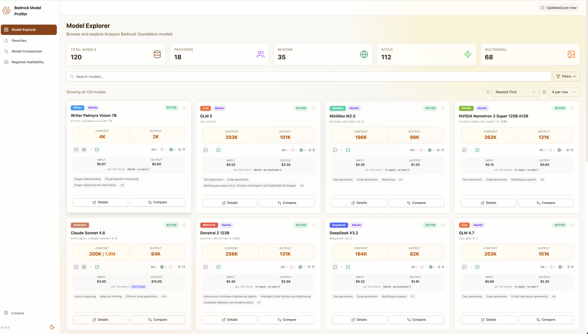
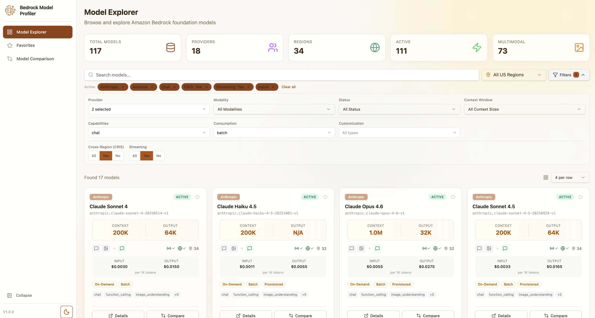
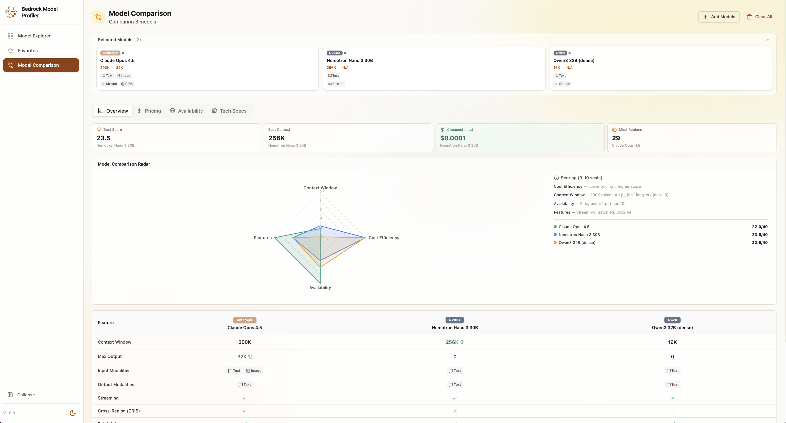
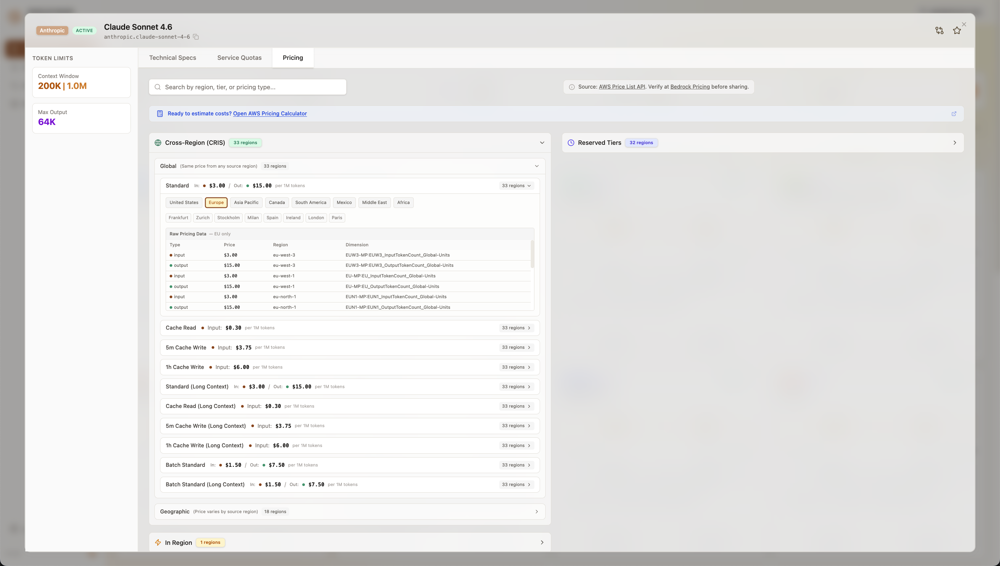
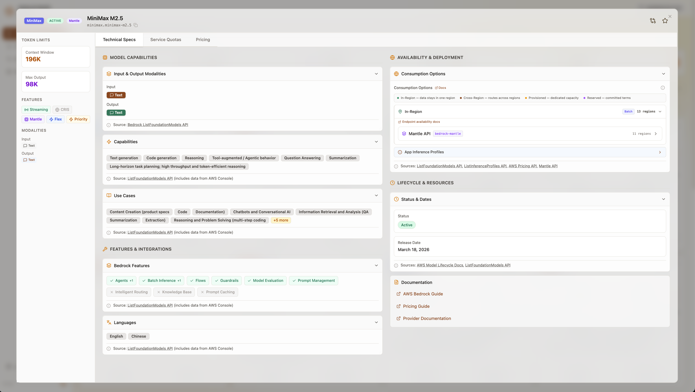
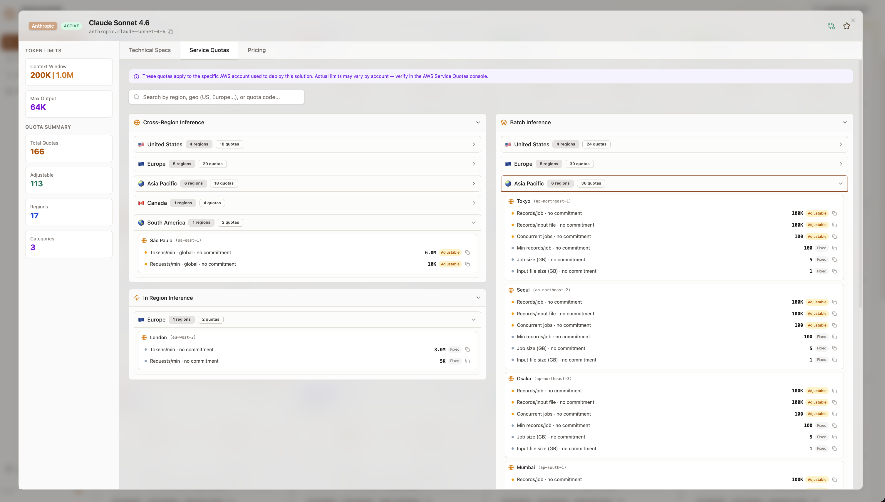
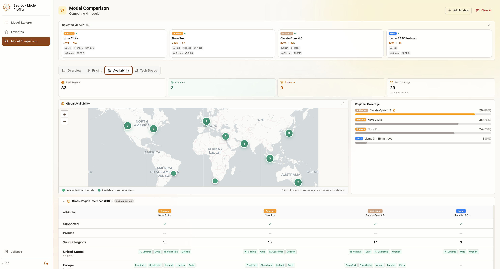

# Amazon Bedrock Model Profiler

A comprehensive tool for exploring, analyzing, and comparing Amazon Bedrock foundation models. Whether you're building new AI applications, optimizing existing workloads, or migrating from other AI services, this profiler provides deep insights into model capabilities, pricing, and regional availability across 100+ models from 17+ providers.



## Use Cases

- **Model Selection** — Compare capabilities, context windows, and specifications to find the right model for your use case
- **Migration Planning** — Analyze Bedrock models when migrating workloads from other AI providers
- **Cost Optimization** — Compare pricing across models, regions, and consumption options (on-demand, batch, provisioned, [CRIS](https://docs.aws.amazon.com/bedrock/latest/userguide/cross-region-inference.html), and Mantle)
- **Regional Planning** — Identify model availability across all AWS regions for multi-region deployments
- **Capability Matching** — Find models with specific features: vision, code generation, embeddings, function calling
- **Quota Analysis** — Review service quotas and throughput limits for capacity planning

> **Terminology:** *CRIS* (Cross-Region Inference) routes requests to the nearest available region for higher throughput. *Mantle* is an AWS-managed regional deployment service for select models. Both are consumption options alongside standard on-demand access.

## Getting Started

### Prerequisites

| Requirement | Option 1 (Local) | Option 2 (AWS Deploy) |
|-------------|:---:|:---:|
| [Node.js 18+](https://nodejs.org/) | Yes | Yes |
| [Python 3.11+](https://www.python.org/) | Yes | Yes |
| [AWS CLI](https://aws.amazon.com/cli/) | Yes | Yes |
| [AWS SAM CLI](https://docs.aws.amazon.com/serverless-application-model/latest/developerguide/install-sam-cli.html) | — | Yes |
| AWS credentials (read access) | Yes | Yes |
| AWS credentials (deploy permissions) | — | Yes |

<details>
<summary>AWS permissions required</summary>

**For local data collection (Option 1):**
```
bedrock:ListFoundationModels
bedrock:ListInferenceProfiles
pricing:GetProducts
pricing:DescribeServices
servicequotas:ListServiceQuotas
```

**For full AWS deployment (Option 2) — additional:**
```
cloudformation:*
s3:*
lambda:*
states:*
iam:CreateRole, iam:AttachRolePolicy, iam:PassRole
cloudfront:*
events:*
logs:*
```
</details>

### Option 1: Local Development (No AWS Infrastructure)

Run the profiler locally using your AWS credentials. No cloud deployment required. Recommended for testing and quick evaluation — for production use with automated daily refresh, see [Option 2](#option-2-full-aws-deployment).

```bash
git clone https://github.com/aws-samples/bedrock-model-profiler.git
cd bedrock-model-profiler

# Set up Python environment
python -m venv .venv
source .venv/bin/activate  # Windows: .venv\Scripts\activate
pip install -r local/requirements.txt

# Collect model data (takes ~90 seconds, auto-copies to frontend)
python -m local collect --profile your-aws-profile

# Start the frontend
cd frontend
npm install
npm run dev
```

Open http://localhost:5173 in your browser. The dev server uses local data files by default — no S3 bucket or AWS deployment needed.

> **Note:** The profiler only shows data for AWS regions that are enabled in your account. To see all regions, [enable them](https://docs.aws.amazon.com/accounts/latest/reference/manage-acct-regions.html) in the AWS Console first. This applies to both local and deployed versions.

### Option 2: Full AWS Deployment

Deploy the complete solution with automated daily data refresh. One command deploys everything:

```bash
./setup-infrastructure.sh bmp
```

This creates two CloudFormation stacks (`bmp-frontend` and `bmp-backend`), seeds placeholder data, builds and deploys the frontend, and triggers the data pipeline. The pipeline automatically collects data within ~3 minutes of deployment, and refreshes daily at 6 AM and 6 PM UTC.

**Deploying to a different region:**
```bash
AWS_REGION=eu-west-1 ./setup-infrastructure.sh bmp
```

This deploys:
- **S3 buckets** for frontend hosting and data storage
- **CloudFront distribution** for global access
- **Step Functions workflow** for automated data collection
- **18 Lambda functions** for data processing and enrichment
- **EventBridge rule** for scheduling

### Updating the Frontend

After making frontend code changes, rebuild and redeploy without redeploying the full infrastructure:

```bash
cd frontend
npm install
npm run build
AWS_REGION=<your-region> FRONTEND_STACK=<stack-name>-frontend ./scripts/deploy.sh
```

Replace `<stack-name>` with the name you passed to `setup-infrastructure.sh` and `<your-region>` with the region you deployed to. The script must be run from the `frontend/` directory. For example:

```bash
cd frontend
AWS_REGION=eu-west-1 FRONTEND_STACK=bmp-frontend ./scripts/deploy.sh
```

This uploads the built files to S3 and invalidates the CloudFront cache. Changes propagate within a few minutes.

## Cost Estimate

The solution uses serverless, pay-per-use services to minimize costs.

| Service | Usage | Estimated Cost |
|---------|-------|---------------|
| **Lambda** | 18 functions x 2 executions/day x ~30s avg | ~$1.00/mo |
| **Step Functions** | 2 workflows/day x ~50 state transitions | ~$0.02/mo |
| **S3** | ~50 MB data + frontend assets, daily writes | ~$0.10/mo |
| **CloudFront** | Depends on traffic; 10K requests/mo | ~$0.10/mo |
| **EventBridge** | 1 scheduled rule | Free tier |
| **CloudWatch Logs** | ~100 MB/mo log ingestion | ~$0.05/mo |
| **AWS API calls** | List operations (~120 calls/day) | Free |

**Estimated total: ~$1-2/month** for typical usage with low traffic. CloudFormation stack creation and SAM deployment are free — you only pay for the resources created.

> **Note:** The self-healing agent (optional) uses Bedrock InvokeModel with Claude, which incurs token-based charges. This only runs when data gaps are detected (~1-2 times/month) and costs approximately $0.01-0.05 per invocation.

## Key Features

<details>
<summary><strong>Model Explorer</strong> — Browse 100+ models with powerful filtering</summary>

Filter by provider, capabilities, modalities, regions, context windows, and more. Adjustable grid density, sorting, search, and light/dark themes.


</details>

<details>
<summary><strong>Model Comparison</strong> — Compare up to 5 models side-by-side</summary>

Four specialized views:
- **Overview** — Capabilities, specifications, and metadata at a glance
- **Pricing** — Per-1M-token costs with region-level granularity (token, image, video, search unit pricing)
- **Availability** — Interactive region map showing on-demand, CRIS, Mantle, batch, and provisioned availability
- **Tech Specs** — Context windows, token limits, streaming support, and customization options


</details>

<details>
<summary><strong>Regional Availability Matrix</strong> — Model-by-region availability analysis</summary>

- All AWS regions with geographic grouping (NAMER, EMEA, APAC, LATAM)
- Five consumption types: on-demand, CRIS, Mantle, batch, provisioned throughput
- Filter by availability type, provider, or model status
- Expandable detail sections showing inference profiles, source regions, and geographic scopes
</details>

<details>
<summary><strong>Detailed Model Cards</strong> — Comprehensive information for each model</summary>

- Input/output modalities and supported features
- Regional availability with cross-region inference support
- Pricing breakdown by region and consumption type
- Service quotas and throughput limits
- Documentation links and provider information


</details>

<details>
<summary><strong>Additional Features</strong></summary>

- **Favorites** — Save a personal shortlist of models for quick access (persisted in browser across sessions)
- **13 Filter Types** — Provider, region, status, CRIS scope, streaming, context window, modality, capabilities, use cases, customization, languages, consumption, and geographic region
</details>

<details>
<summary><strong>More Screenshots</strong></summary>

### Model Card - Specifications


### Model Card - Quotas


### Comparison - Regional Availability

</details>

## Architecture

```
┌─────────────────────────────────────────────────────────────────┐
│                         CloudFront                              │
│                    (Frontend + Data CDN)                        │
└────────────────────────┬────────────────────────────────────────┘
                         │
         ┌───────────────┴───────────────┐
         │                               │
         ▼                               ▼
┌─────────────────┐           ┌─────────────────────┐
│  Frontend S3    │           │    Data S3           │
│  (React App)    │           │ (models + pricing)   │
└─────────────────┘           └──────────▲───────────┘
                                         │
┌────────────────────────────────────────┴──────────────────────────┐
│                     Step Functions Workflow                       │
│                     (Daily at 6 AM and 6 PM UTC)                 │
├─────────────┬─────────────────┬──────────────┬───────────────────┤
│  Phase 1    │  Phase 1        │  Phase 1     │  Phase 2+3        │
│  Pricing    │  Model          │  Quota       │  Enrichment,      │
│  Collector  │  Extractor      │  Collector   │  Aggregation,     │
│  (3 svc)    │  (all regions)  │  (all reg)   │  Gap Detection    │
└─────────────┴─────────────────┴──────────────┴───────────────────┘
```

### Project Structure

```
bedrock-model-profiler/
├── frontend/                 # React + Vite + Tailwind CSS application
│   ├── src/
│   │   ├── components/       # UI components (models/, comparison/, layout/, ui/)
│   │   ├── hooks/            # Data fetching hooks
│   │   ├── stores/           # Zustand state management (comparison, favorites)
│   │   ├── utils/            # Filters, region utilities
│   │   └── config/           # Constants and data source config
│   └── scripts/              # Deployment scripts
├── backend/
│   ├── lambdas/              # 18 Python Lambda functions
│   ├── layers/common/        # Shared Lambda layer (model matching, caching, config)
│   ├── statemachine/         # Step Functions ASL workflow definition
│   ├── config/               # Externalized pipeline configuration
│   └── tests/                # ~150 tests
├── local/                    # CLI tool for local data collection
├── infra/                    # SAM/CloudFormation templates
├── setup-infrastructure.sh   # One-command deployment
└── cleanup.sh                # One-command teardown
```

## Troubleshooting

### Local Development

**"File not found" error in browser**
- Run `python -m local collect` to generate data files
- Verify `frontend/public/latest/bedrock_models.json` exists

**"Access Denied" during data collection**
- Verify AWS credentials: `aws sts get-caller-identity`
- Check your profile has Bedrock and Pricing API access
- Some regions may fail due to Bedrock not being available — this is normal

**Frontend won't start**
- Delete `node_modules` and `package-lock.json`, then run `npm install`
- Ensure Node.js 18+ is installed: `node --version`

### AWS Deployment

**No models showing after deployment**
- The data pipeline runs automatically on first deploy and twice daily thereafter
- Manually trigger: AWS Console -> Step Functions -> Start execution
- Check CloudWatch Logs for Lambda errors

**CloudFormation deployment fails**
- Verify SAM CLI is installed: `sam --version`
- Check you have sufficient IAM permissions (see Prerequisites)
- Review the error in CloudFormation console for specific resource failures

**Stale data**
- Data refreshes twice daily (6 AM and 6 PM UTC)
- Manually trigger the Step Functions workflow for immediate refresh

## Cleanup

Remove all deployed resources and stop incurring charges:

```bash
./cleanup.sh bmp                              # Uses us-east-1
AWS_REGION=eu-west-1 ./cleanup.sh bmp         # Specify region
```

This empties the S3 buckets and deletes both CloudFormation stacks. See [`cleanup.sh`](cleanup.sh) for details.

## Important Notes

This tool is designed for exploration, analysis, and planning. While it uses official AWS APIs, please note:

- **Verify before production decisions** — Always confirm pricing and availability in the [AWS Console](https://console.aws.amazon.com/bedrock/)
- **Data freshness** — Model availability and pricing can change; data refreshes twice daily
- **Regional variations** — Some features may not be available in all regions
- **Enabled regions only** — The profiler collects data only from regions enabled in your AWS account. [Enable additional regions](https://docs.aws.amazon.com/accounts/latest/reference/manage-acct-regions.html) to see more availability data
- **Consult AWS** — Contact your AWS account team for production workload guidance

## Contributing

Contributions are welcome! Here's how to get started:

1. Fork the repository and create a feature branch
2. Set up local development (see [Quick Preview](#quick-preview) or [Option 1](#option-1-local-development-no-aws-infrastructure))
3. Run backend tests: `cd backend && PYTHONPATH=layers/common/python:lambdas python -m pytest tests/ -x -v --tb=short`
4. Submit a pull request with a clear description of your changes

For bugs or feature requests, please [open an issue](../../issues).

## License

This project is licensed under the MIT License — free to use in personal or commercial projects. See the [LICENSE](LICENSE) file for details.
