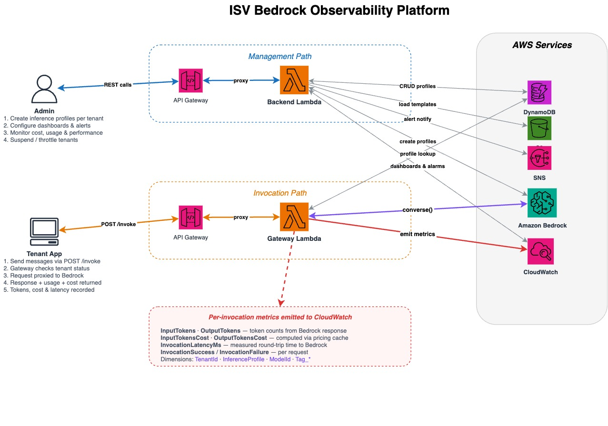

# Bedrock Observability Platform

A serverless platform for monitoring and managing multi-tenant Amazon Bedrock usage. It provides per-tenant cost tracking, performance dashboards, alerting, and access control through Bedrock inference profiles.

## Architecture



The platform has two main paths:

**Management Path** — An admin uses the React UI to create inference profiles, configure CloudWatch dashboards and alerts, monitor cost/usage/performance, and suspend or throttle tenants. Requests flow through API Gateway to a Backend Lambda that manages DynamoDB records, CloudWatch dashboards/alarms, Bedrock inference profiles, SNS topics, and S3 templates.

**Invocation Path** — Tenant applications send messages via `POST /invoke`. The Gateway Lambda checks the tenant's status (active/suspended/throttled), proxies the request to Bedrock `converse()` through the tenant's dedicated inference profile, and emits per-invocation CloudWatch metrics: token counts, costs, latency, and success/failure — all tagged with TenantId, InferenceProfile, ModelId, and custom tag dimensions.

## Key Features

- **Per-tenant inference profiles** — Each tenant gets a dedicated Bedrock inference profile with cost allocation tags, enabling isolated metrics and billing attribution.
- **CloudWatch dashboards** — Template-based dashboards (Cost, Performance, Capacity, Efficiency, Executive Summary, Latency) that support multi-tenant comparison, custom widget selection, and analysis overlays (trend, anomaly detection).
- **Alerting with actions** — CloudWatch alarms with three action types: notify (SNS email), throttle (auto-block with 429), or suspend (hard block with 403). Supports absolute and percentage-based thresholds with auto-recovery.
- **3-tier pricing discovery** — Automatic model pricing lookup: AWS Price List API, AmazonBedrockService fallback, then webpage bulk JSON scrape. Results cached in DynamoDB for 24 hours.
- **Tag-based filtering** — Predefined tag categories (Tenant, Environment, Region, Application, User, Model) flow through to CloudWatch dimensions, enabling tag-based dashboard filtering and cost grouping.

## Project Structure

```
backend/                  # Backend Lambda (Python)
  handler.py              # Router — dispatches to handler modules by path
  handlers/
    profiles.py           # CRUD for tenant profiles + Bedrock inference profiles
    dashboards.py         # CRUD for CloudWatch dashboards from templates
    alerts.py             # CRUD for CloudWatch alarms + SNS + throttle/suspend
    metrics.py            # Proxy for CloudWatch GetMetricData / ListMetrics
    discovery.py          # Model listing + 3-tier pricing lookup
    cost_explorer.py      # AWS Cost Explorer queries by tenant tags
    reports.py            # Placeholder (not yet implemented)
  shared/
    dynamo_utils.py       # DynamoDB CRUD helpers
    dashboard_builder.py  # Pure-functional CloudWatch dashboard JSON builder
    tag_utils.py          # Tag validation, filtering, CW dimension conversion
    pricing.py            # 3-tier pricing with DynamoDB cache

gateway/                  # Gateway Lambda (Python)
  handler.py              # Invoke proxy — status check, Bedrock call, metric emission
  status_cache.py         # In-memory TTL cache for tenant status (30s)

frontend/                 # React UI (TypeScript + Vite)
  src/
    pages/                # Profiles, Dashboards, Alerts, Discovery, Invoke
    api/                  # API client modules
    components/           # Layout, ProfileForm, TagFilterBar, PieChart, etc.
    types/                # TypeScript interfaces

cdk/                      # AWS CDK infrastructure (Python)
  stacks/
    foundation_stack.py   # DynamoDB tables, S3 bucket, IAM roles
    backend_stack.py      # Backend API Gateway + Lambda
    gateway_stack.py      # Gateway API Gateway + Lambda

seed/
  dashboard_templates.json  # Dashboard template definitions (6 templates)
```

## Infrastructure

Deployed via AWS CDK as three stacks:

| Stack | Resources |
|-------|-----------|
| **Foundation** | 5 DynamoDB tables (Tenants, ProfileMappings, PricingCache, Dashboards, Alerts), S3 bucket, IAM roles |
| **Backend** | API Gateway (REST, proxy integration) + Backend Lambda |
| **Gateway** | API Gateway (REST) + Gateway Lambda |

## Getting Started

### Prerequisites

- AWS account with Bedrock model access
- Python 3.12+, Node.js 20+, AWS CDK CLI
- AWS credentials configured

### Deploy

```bash
cd cdk
pip install -r requirements.txt
cdk deploy --all
```

### Run the UI

```bash
# Copy .env.example to .env and set your API Gateway URLs
cp frontend/.env.example frontend/.env

# Start the dev server
./start-ui.sh
```

### Quick Test

```bash
# Create a profile
curl -X POST $BACKEND_API/profiles \
  -H "Content-Type: application/json" \
  -d '{"tenant_name": "my-tenant", "model_id": "us.anthropic.claude-haiku-4-5-20251001-v1:0", "region": "us-east-1"}'

# Invoke via the gateway (use the tenant_id from the response above)
curl -X POST $GATEWAY_API/invoke \
  -H "Content-Type: application/json" \
  -H "Tenant-Id: <tenant_id>" \
  -d '{"messages": [{"role": "user", "content": [{"text": "Hello!"}]}]}'
```

## API Endpoints

### Backend API

| Method | Path | Description |
|--------|------|-------------|
| GET/POST | `/profiles` | List or create profiles |
| GET/PUT/DELETE | `/profiles/{id}` | Get, update, or delete a profile |
| POST | `/profiles/{id}/activate` | Activate a profile |
| POST | `/profiles/{id}/suspend` | Suspend a profile |
| GET/POST | `/dashboards` | List or create dashboards |
| GET/PUT/DELETE | `/dashboards/{id}` | Get, update, or delete a dashboard |
| GET/POST | `/alerts` | List or create alerts |
| GET/PUT/DELETE | `/alerts/{id}` | Get, update, or delete an alert |
| GET | `/metrics/query` | Query CloudWatch metrics |
| GET | `/metrics/list` | List available metrics |
| GET | `/discovery/models` | List Bedrock foundation models |
| GET | `/discovery/pricing` | Get model pricing |
| GET | `/cost-explorer/profile-costs` | Get per-tenant cost data |

### Gateway API

| Method | Path | Description |
|--------|------|-------------|
| POST | `/invoke` | Proxy to Bedrock converse() with metrics |
