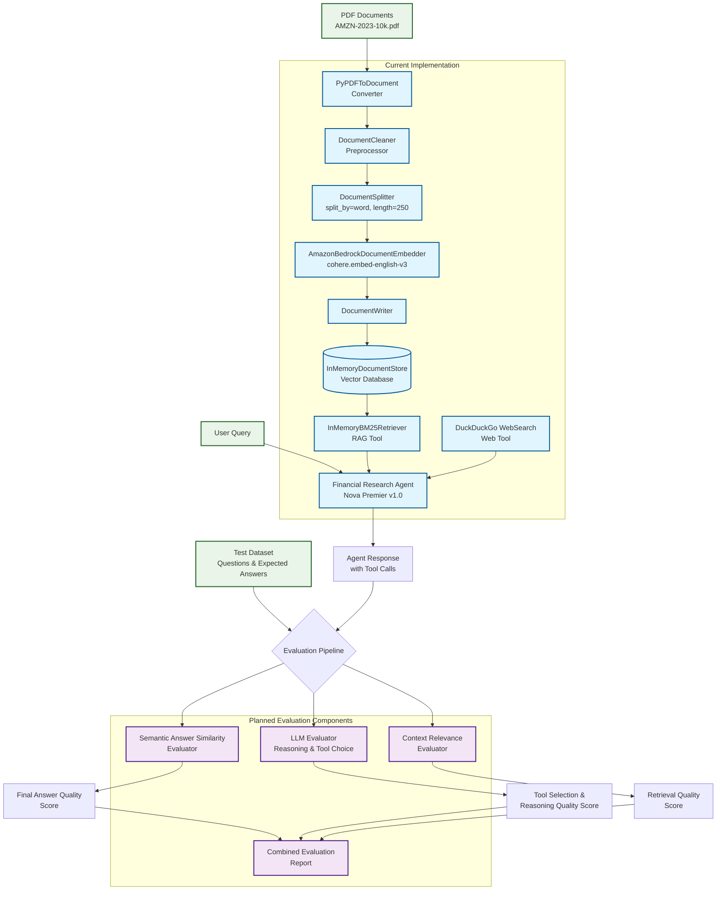

# Haystack Pipeline Architecture Diagram

## Diagram Overview

This diagram shows your complete Haystack pipeline architecture:

### Current Implementation (Blue Components)
- **Document Ingestion**: PDF → Converter → Cleaner → Splitter → Embedder → Vector Store
- **Agent Pipeline**: User query → Agent with RAG + Web Search tools → Response

### Planned Evaluation Components (Purple Components)
- **Semantic Answer Similarity**: Evaluates final answer quality
- **LLM Evaluator**: Assesses reasoning and tool choice correctness
- **Context Relevance**: Measures retrieval quality

### Key Features
- Color-coded components by type (Haystack/Evaluation/Data)
- Shows data flow and dependencies
- Highlights both current and planned components
- Demonstrates end-to-end evaluation strategy